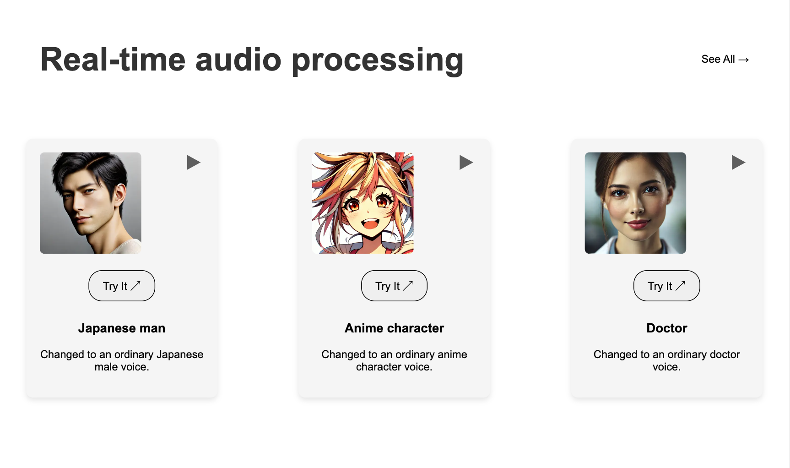
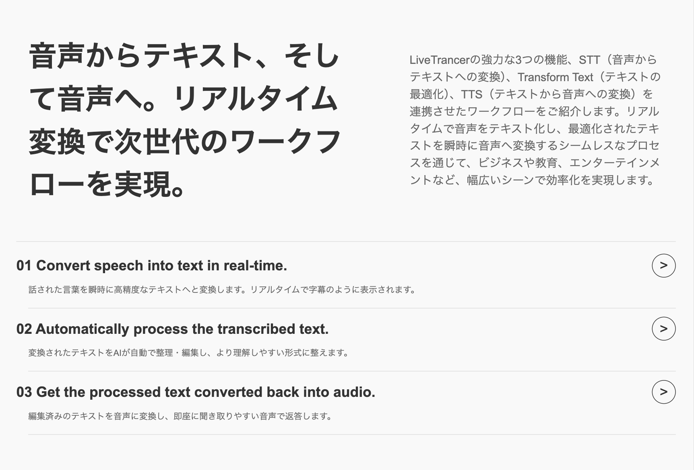
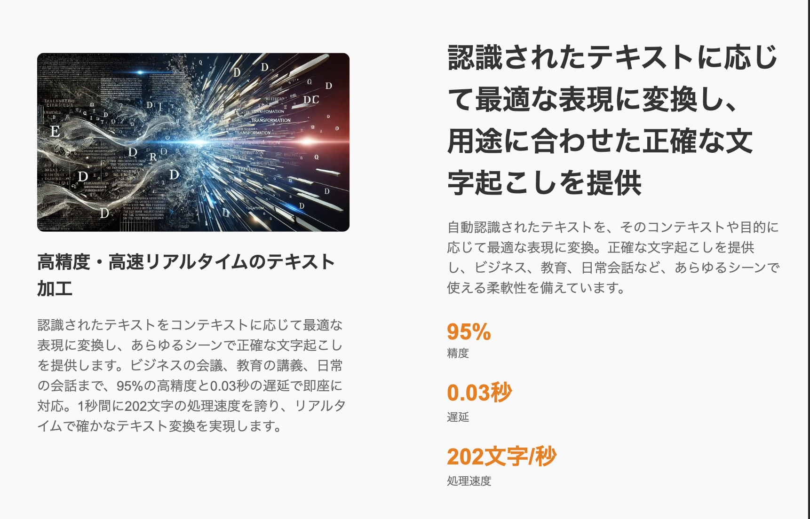
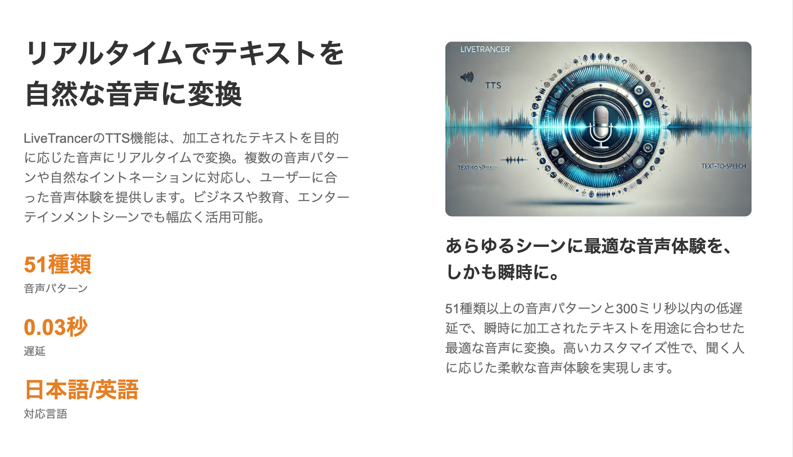
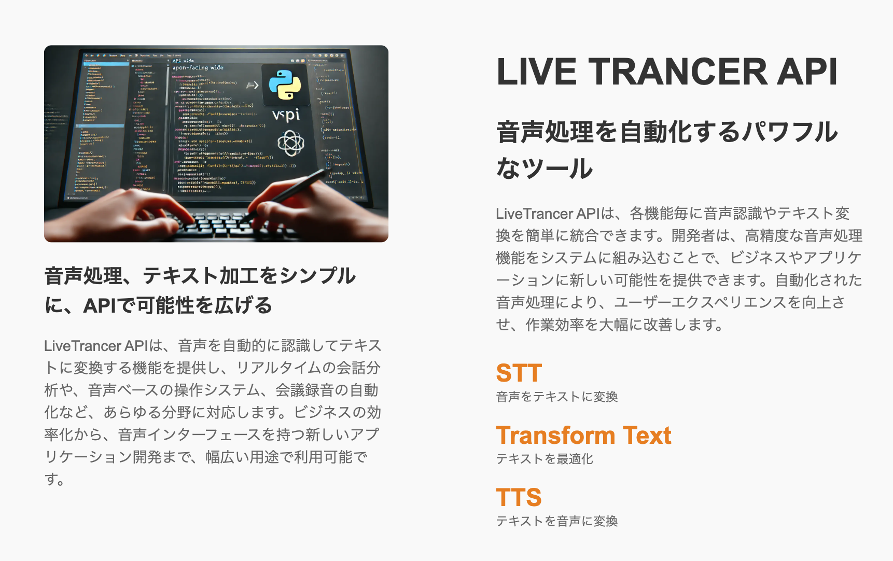
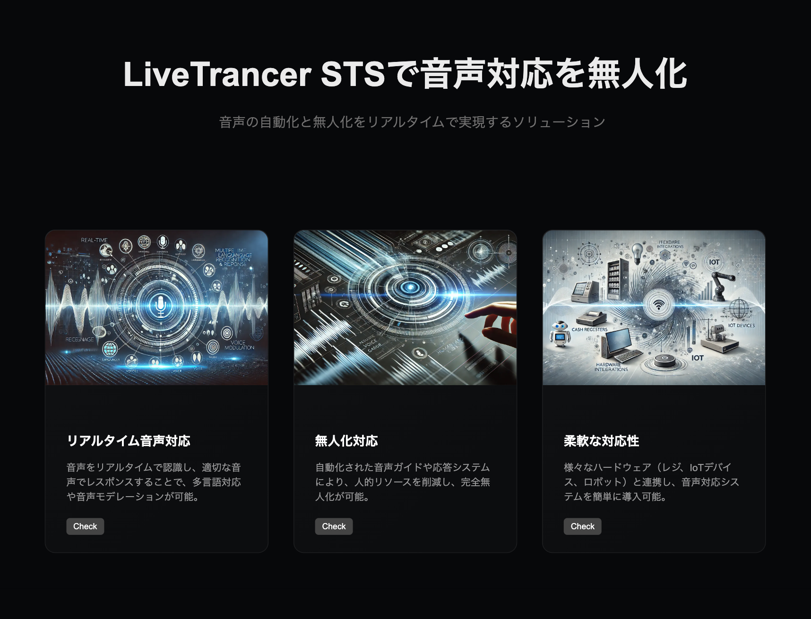
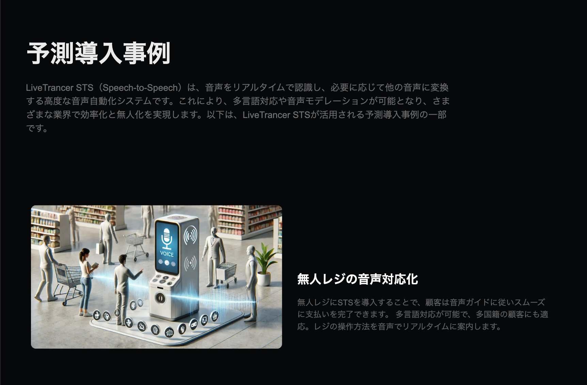
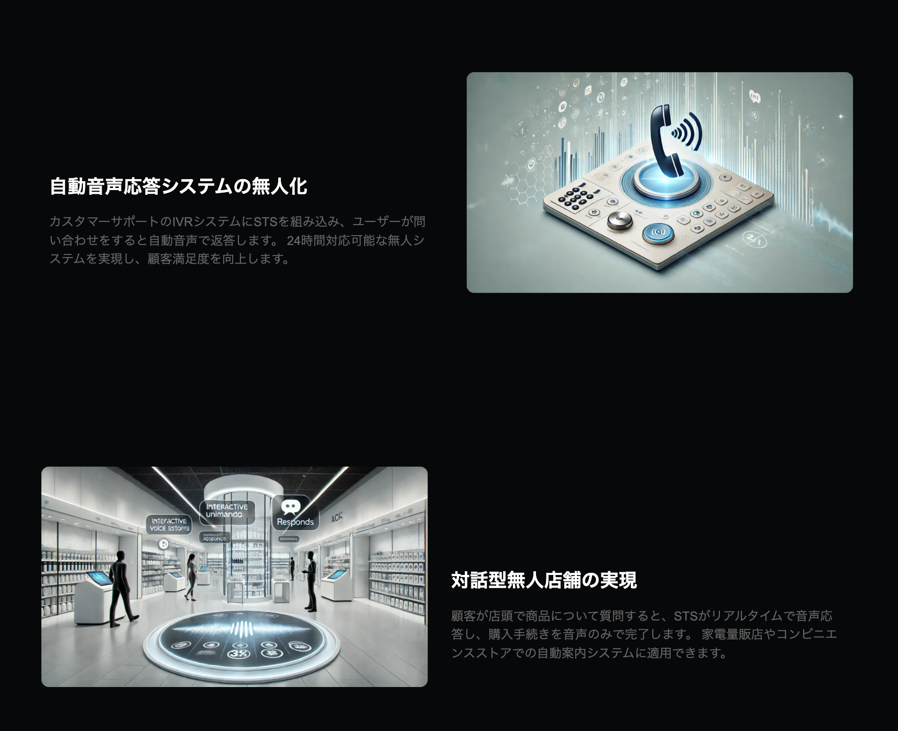

<h1 align="center">LiveTrancer</h1>

  

## Abstract
LiveTrancer is a web application that summarizes audio input in real-time and outputs the summarized content in both audio and text formats. This app is designed to quickly and concisely capture important information in various scenarios, such as meetings, presentations, customer support, and educational environments.

 
Please select your language.

## Languages / 言語

- [English](./README_en.md)
- [日本語](./README_ja.md)

 

## Features

  

  

  

  

  

  

  

  

  

  

## Tech info

- [English](./README_en.md)
- [日本語](./README_ja.md)

 
